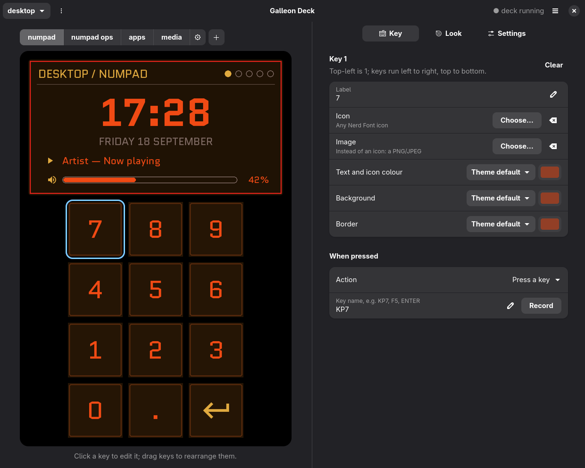

# galleon-deck

Stream Deck support on Linux for the **Corsair Galleon 100 SD** keyboard: the 12 LCD
keys, the top screen, and the two dials. Elgato's Stream Deck software only runs on
Windows and macOS, so this project takes its place.

<p align="center"></p>



📖 **[Read the wiki](https://github.com/NLMP-DDHS/galleon-deck/wiki)** for a full guide to the app, config files and troubleshooting.

- **Profiles and pages** of 12 keys, like Elgato's app: icons, labels, images, colours.
- **Key actions:** numpad keys, any key or shortcut, run a command (with an optional ✓/✗
  flash when it finishes), media controls, switch page, switch profile.
- **Top screen:** profile and page, a clock and date, what's playing, a volume bar.
- **Dials:** left sets the volume and mutes when pressed. Right turns through pages,
  returns to the start page when pressed, and switches profile when held and turned.
- **Auto-switching:** changes profile when a game or app gets focus (Hyprland, Sway,
  i3, niri and X11 desktops).
- **Themes:** 7 built-in themes, your own, or one **generated from your wallpaper**.
  Themes can use rounded keys or a sci-fi `hud` style with cut corners.
- **Add-ons (optional):** ready-made profiles for games, with their own themes and
  auto-switch rules. Each is a separate download from the
  [add-on releases](https://github.com/NLMP-DDHS/galleon-deck-addons/releases)
  (Star Citizen so far). Skip them if you don't need them; install the ones you want
  from the app's **Add-ons** tab.
- **Profile switch:** a short glitch as the deck changes profile, with the new
  profile's logo (or its name) resolving on the top screen.
- **Boot animation:** a CRT power-on effect, a terminal boot log, your logo glitching in,
  and keys that "decrypt" one by one. Plays at login and when the keyboard is plugged in.
  Your own GIF also works.
- **Galleon Deck app:** a desktop app to customize all of this, with a live preview.
  The real deck updates as you edit.
- **Fails safe:** if the service stops, the keyboard falls back to its own numpad mode.

> Not affiliated with Corsair or Elgato. The protocol comes from the open-source
> [node-elgato-stream-deck](https://github.com/Julusian/node-elgato-stream-deck) library,
> which added Galleon support in v7.5.0.

## Compatibility

| | |
|---|---|
| Hardware | Corsair Galleon 100 SD (Stream Deck part: USB `1b1c:2b18`) |
| Distros | Arch/CachyOS/Manjaro, Debian 13+/Ubuntu 24.04+, Fedora, openSUSE; others with manual packages |
| Desktops | Any Wayland or X11 desktop: GNOME, KDE Plasma, Hyprland, Sway, niri, XFCE, … |
| Audio | PipeWire (`wpctl`) or PulseAudio (`pactl`) |
| Init | systemd user service, or XDG autostart without systemd |
| Python | 3.10+ (3.10 needs `tomli`) |
| App | GTK 4 + libadwaita 1.5+ (the service itself doesn't need them) |

Some features depend on the desktop:

| Feature | Where it works |
|---|---|
| Auto-switch profiles by focused window | Hyprland, Sway, i3, niri, any X11 session. Not yet on GNOME or KDE Plasma under Wayland ([#3](https://github.com/NLMP-DDHS/galleon-deck/issues/3)). |
| NumLock handled for the deck's numpad | Hyprland and X11. Elsewhere your desktop's NumLock applies (keep it on). |
| Wallpaper detection | noctalia, swww, hyprpaper, GNOME. For anything else, set `command` under `[wallpaper_theme]`. |
| Now-playing on the top screen | Any player that supports MPRIS (needs `playerctl`) |

Developed and tested on CachyOS with Hyprland. Other distros and desktops are
supported by design but less tested. Reports and pull requests are welcome.

## Install

**Arch/CachyOS/Manjaro:** install [`galleon-deck-git`](https://aur.archlinux.org/packages/galleon-deck-git)
from the AUR, then start the service for your user:

```sh
paru -S galleon-deck-git
systemctl --user enable --now galleon-deck
```

**Other distros**, or to run from a checkout:

```sh
git clone https://github.com/NLMP-DDHS/galleon-deck
cd galleon-deck
./install.sh
```

The installer:
- installs the packages for your distro (pacman, apt, dnf or zypper);
- fetches the icon font if your distro doesn't package it;
- copies the service to `~/.local/share/galleon-deck` and adds `galleon-deck` and
  `galleon-deck-config` to `~/.local/bin`;
- creates a starter config in `~/.config/galleon-deck`;
- asks for `sudo` once, for a udev rule that gives your user access to the deck and to
  `/dev/uinput`;
- starts the service.

Options: `--dev` runs from the checkout instead of copying. `--no-deps` skips the
packages. `--no-root` prints the root commands instead of running them.
`./uninstall.sh [--purge]` removes everything; `--purge` also removes your config.

## Use

The [wiki](https://github.com/NLMP-DDHS/galleon-deck/wiki) covers every panel, key action and setting in detail.

Open **Galleon Deck** from your app menu, or run `galleon-deck-config`:

- **Key:** click a key in the preview to change its label, icon (a searchable picker
  with 10,000+ icons), image, colours, and what it does. Drag keys to rearrange them.
- **Look:** pick a theme, generate one from your wallpaper, or tweak single colours.
- **Settings:** brightness, dial volume step, clock, boot animation, and auto-switch rules.
- **Profiles and pages:** the menus next to them add, rename, reorder and delete.
- **Add-ons:** **Install from file…** takes a downloaded add-on package (`.tar.gz`).
  The tab then upgrades and removes add-ons and runs their tools, like syncing a
  game's keybinds. From a terminal: `galleon-addon install ~/Downloads/star-citizen-1.0.0.tar.gz`,
  `galleon-addon list`, `galleon-addon remove star-citizen`.

The app follows the deck. It opens on the profile and page the deck is showing, and
switches along when the deck changes, for example when a game takes focus. Pick
another profile in the app to edit it; the app stays on it until the deck moves again.

Every change is saved immediately and shows up on the deck within a second.

On the deck itself, each profile's last page is a generated **settings page** with a key
per theme, a key that builds a theme from your wallpaper, brightness keys, and a key per
profile.

### Config files

Everything lives in `~/.config/galleon-deck` as commented TOML, so you can edit it by hand
too:

```
config.toml          global settings, auto-switch rules, boot animation, wallpaper theme
profiles/<name>.toml one per profile: its theme and pages of keys
themes/<name>.toml   your own themes, or overrides of built-in ones (any subset of colours)
```

A profile can bring its own auto-switch rules, checked before the ones in
`config.toml`: `auto_switch = [{ class = "^mygame$" }]` at the top of its file.
Add-ons use this, so removing one also removes its rule.

[`examples/config.toml`](examples/config.toml) documents every option. A key looks like:

```toml
{ icon = "\U000F066F", label = "Discord", exec = "discord" }
{ label = "7", key = "KP7" }
{ icon = "\U000F0100", label = "Shot", confirm = true, exec = "grim ~/shot.png" }
```

Useful commands:
- `galleon-deck --version` prints the version (add-ons can require a minimum).
- `galleon-deck --theme-from-wallpaper [image]` builds the wallpaper theme from a terminal.
- `journalctl --user -u galleon-deck` shows the service log.
- `systemctl --user restart galleon-deck` restarts the service and replays the boot animation.

## Troubleshooting

- **The deck shows its own screen and numpad:** the service isn't running or can't reach
  the device. Check the log. If it reports permission denied, the udev rule isn't active:
  re-run `./install.sh`, or replug the keyboard.
- **Numpad keys type arrows or Home/End:** NumLock is off. The service turns it on for its
  own virtual keyboard on Hyprland and X11; on other desktops, turn NumLock on.
- **Buttons that launch apps do nothing:** the command isn't on the service's PATH. The
  systemd unit adds `~/.local/bin`; use full paths for anything else.
- **Auto-switch doesn't react:** see the compatibility table. Find a window's class with
  `hyprctl activewindow`, `swaymsg -t get_tree`, or `xprop WM_CLASS`.

## Backlight (RGB)

The keyboard's RGB backlight isn't supported yet. Its control protocol (Corsair's "V2"/Bragi,
on the main keyboard's USB interface 1) answers read-only queries safely. But colour
writes with the wrong buffer layout **froze typing until the keyboard was unplugged**.


## How it works

See [docs/PROTOCOL.md](docs/PROTOCOL.md). In short, the service:
- sends a keep-alive feature report every 500 ms, which puts the deck in host mode;
- draws JPEG images to the keys and the screen;
- reads key and dial reports;
- types keys through a uinput virtual keyboard.

If the keep-alive stops, the firmware returns to its standalone numpad mode.

## License

MIT, see [LICENSE](LICENSE).
